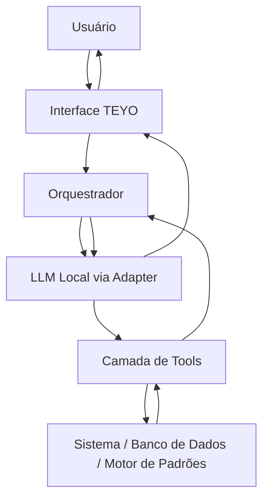

# ARCHITECTURE.md

## Diagrama conceitual (DECIDIDO)



## Responsabilidades por camada

### Interface TEYO
Renderiza a conversa e as telas dos módulos. Envia mensagens do usuário ao Orquestrador. Não contém lógica de negócio.

### Orquestrador
DECIDIDO: componente do sistema TEYO, não é o LLM. Recebe a mensagem do usuário, monta o contexto (memória relevante, padrões relevantes, preferências, tools disponíveis), chama o LLM Provider, interpreta a resposta (texto e/ou chamadas de tool), executa as tools através da camada de Tools, devolve o resultado ao LLM para gerar a resposta final ao usuário.

### LLM Provider / Adapter
NECESSÁRIO PARA IMPLEMENTAÇÃO: interface fixa entre o Orquestrador e o modelo real, para permitir trocar o modelo sem reescrever o Orquestrador. Ver `LLM.md`.

### Camada de Tools
DECIDIDO: todas as ações que alteram ou consultam dados passam por tools com contrato definido (ver `TOOLS.md`). O LLM nunca acessa o banco diretamente.

### Sistema / Banco de Dados / Motor de Padrões
Contém: persistência (`DATABASE.md`), regras de negócio (`BUSINESS_RULES.md`), cálculos determinísticos, Motor de Padrões (`PATTERN_ENGINE.md`), planejador (`PLANNER.md`), gamificação e estado do mascote.

## O que o LLM NUNCA deve fazer sozinho (DECIDIDO)

- Persistência de dados (banco, memória permanente, memória temporária).
- Cálculos (financeiros, de produtividade, de XP).
- Regras de negócio.
- Controle de permissões.
- Execução direta de ações (sempre via tool).
- Aprendizado/detecção estatística de padrões.
- Determinar XP ou evolução do mascote.
- Gerar relatórios com números — ele interpreta números já calculados pelo sistema.

## Multiusuário na V1

DECIDIDO: a V1 começa com um único usuário ativo, mas a arquitetura e o modelo de dados já devem ser preparados para múltiplos usuários.

- Entidades pertencentes ao usuário carregam `user_id` desde a V1.
- Consultas e operações devem respeitar o isolamento por `user_id`.
- A existência futura de uma segunda conta e de dados/listas compartilháveis deve ser compatível com o modelo de dados.
- Convites, permissões granulares, administração de contas e experiência completa de compartilhamento ficam FORA DO V1.


## Stack técnica

A DEFINIR — OPÇÃO RECOMENDADA: backend em Python (facilita integração com runtime local de LLM tipo llama.cpp/Ollama) + frontend web/PWA em stack componentizada (ex. React) + banco relacional (Postgres ou SQLite para V1 local). Esta é uma recomendação, não uma decisão — precisa ser confirmada por Jams antes da FASE 0 do roadmap.

## Estrutura de pastas proposta

NECESSÁRIO PARA IMPLEMENTAÇÃO:

```
teyo/
  backend/
    api/                # endpoints
    orchestrator/        # orquestrador
    llm/                 # adapter + provider concreto
    tools/                # implementação de cada tool
    pattern_engine/
    planner/
    gamification/
    mascot/
    db/
      models/
      migrations/
  frontend/
    src/
      screens/
        home/
        teyo-chat/
        tasks/ habits/ goals/ studies/ career/ finance/ market/ home/ agenda/ news/ reports/
      components/
      state/
  docs/                   # esta documentação
  tests/
    unit/ integration/ e2e/
```

Esta estrutura é uma recomendação técnica (NECESSÁRIO PARA IMPLEMENTAÇÃO), pode ser ajustada pelo Claude Code desde que mantenha a separação: orquestrador ≠ LLM ≠ tools ≠ pattern engine ≠ persistência.
