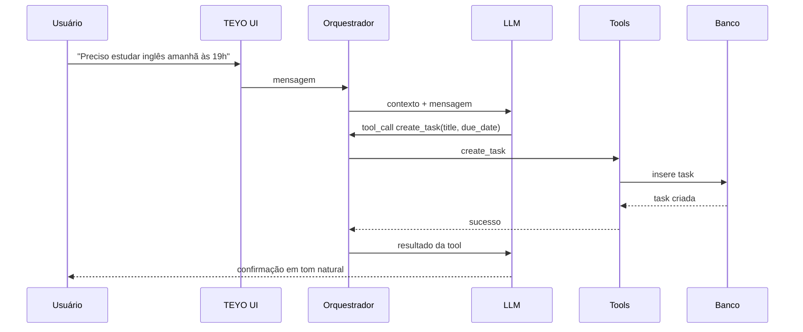
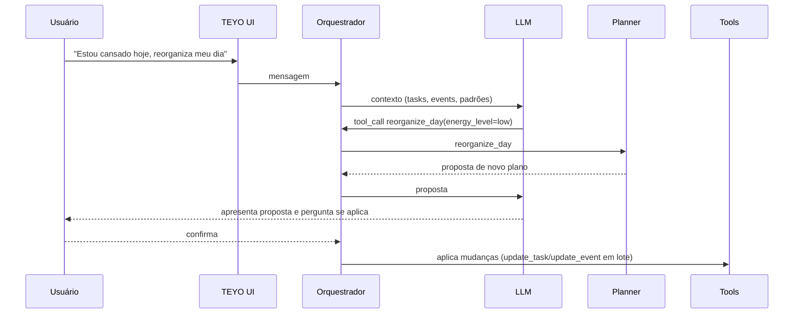

# FLOWS.md

## 1. Usuário cria tarefa conversando com TEYO

## 2. Usuário altera tarefa
Mesmo fluxo do item 1, com `update_task`. Se houver mais de uma tarefa possível para "essa tarefa", o Orquestrador/LLM pergunta qual antes de chamar a tool (regra 5 de `BUSINESS_RULES.md`).

## 3. Usuário remove tarefa
Mesmo fluxo, com `delete_task`. Antes da chamada, o TEYO pede confirmação explícita (regra 4 de `BUSINESS_RULES.md`).

## 4. Usuário cria compromisso
Mesmo padrão do item 1, com `create_event`. Data/hora em linguagem natural ("amanhã às duas") é normalizada pelo Orquestrador antes da chamada de tool.

## 5. Usuário reorganiza o dia

## 6. TEYO consulta padrão
Chamada de `get_patterns` pelo Orquestrador quando o usuário pergunta algo relacionado a rotina (ex.: "você percebeu alguma mudança na minha rotina?"). Retorno estruturado (ver `PATTERN_ENGINE.md`) é passado ao LLM para interpretação.

## 7. TEYO detecta mudança de padrão
O Motor de Padrões roda de forma assíncrona/periódica sobre o histórico (NECESSÁRIO PARA IMPLEMENTAÇÃO: gatilho exato A DEFINIR — job periódico vs. cálculo sob demanda). Quando a confiança de mudança ultrapassa o limiar (A DEFINIR), o resultado fica disponível via `get_routine_changes` para o TEYO comentar proativamente na próxima conversa.

## 8. Usuário pergunta sobre produtividade
`get_productivity_report` retorna números do sistema; LLM interpreta e explica (nunca inventa números — regra 6/7 de `BUSINESS_RULES.md`).

## 9. Usuário conversa sobre objetivo
Pode ser conversa pura (sem tool) ou `update_goal` se houver mudança real declarada.

## 10. Usuário adiciona item ao mercado
`add_market_item`. Exemplo do histórico de substituição em uma frase ("tira café, coloca arroz") exige que o Orquestrador resolva duas ações (remove + add) a partir de uma única mensagem.

## 11. Usuário usa Pomodoro
Usuário ativa Pomodoro em uma tarefa (opcional). Estado do Pomodoro (ativo, pausado, concluído) é controlado pelo sistema; conclusão pode gerar evento de gamificação.

## 12. Mascote reage
Evento do sistema (tarefa concluída, conquista) dispara atualização de `mascot_state.current_expression`, consumida pela UI.

## 13. Usuário evolui de nível
Evento de gamificação leva `xp_total` a cruzar o limiar de nível (A DEFINIR o valor); sistema atualiza `gamification_state` e `mascot_state.evolution_stage`; TEYO comenta a evolução na conversa.

## 14. Usuário conversa sobre algo que não exige tool
LLM responde diretamente, sem chamar nenhuma tool — reconhecendo a diferença entre conversa e ação (regra do histórico, doc. 3, item 35).

## 15. LLM não tem informação suficiente
LLM não chama tool com parâmetro inventado; pergunta ao usuário o dado faltante antes de qualquer chamada (regra 14 de `BUSINESS_RULES.md`).
